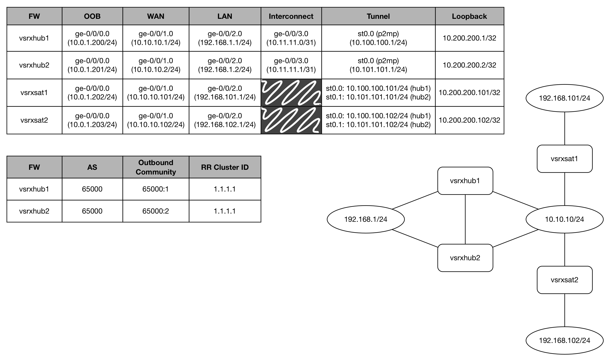

# Example Multi-Hub & Spoke VPN on SRX with BGP

This is an example showing 3 sites.  A redundant hub site, and 2 satellite locations.  All of the WAN-side interfaces on the firewalls are statically assigned, but the hub-side of the tunnels are configured such that you could be using DHCP-assigned WAN interfaces on your satellite locations.

While I built this using vSRX 12.x, you could easily do this using vSRX 15, or pretty much any SRX platform you could lay your hands on, with minimal changes. If you're adapting these configs to something else, you'll likely need to change interface names around to suit your environment.

In the sample configurations, the root password and the VPN PSK are both "abc123". Please, don't use that in real life. Be smart, choose your passwords and PSKs wisely.

It's also worth noting that each vSRX has its ge-0/0/0 interface as a management interface in the 10.0.1.0/24 LAN, which is isolated to its own VR. Obviously, this will change for you as well.

## The Diagram


As you've surmised, this isn't a 100% real-life configuration, as you won't have WAN-side IP addresses all in the same /24, but you still get the idea.

## Determinism in Routing
In networking, deterministic network behavior is often highly prized.  In our example here, the satellite locations all prefer to send their traffic via their VPN tunnels to vsrxhub1. This is being accomplished using a BGP import policy on the satellites.  This policy alters the BGP localpref attribute based on which peer it learned the route from.  To keep this classification process simple, our hubs are adding a BGP community tag to all routes being advertised to the satellites. Each hub is using its own community tag, so it's quite easy to differentiate a route learned from hub1 vs hub2.  In our example, routes learned from hub1 get 50 added to the localpref, and routes learned from hub2 have 50 subtracted from the localpref.  Thus, routes learned from hub1 will have localpref 150, while routes learned from hub2 will have localpref 50.  When comparing localpref values, higher is more desirable, so hub1 will always be preferred over hub2.

## The View From One of the Hubs
```
root@vsrxhub1> show security ike security-associations
Index   State  Initiator cookie  Responder cookie  Mode           Remote Address
3126079 UP     acc688c41a029562  6c4de2ff1014f7e1  IKEv2          10.10.10.102
3126078 UP     e4ba2d43cfadf3c2  185a67bf1af52101  IKEv2          10.10.10.101

root@vsrxhub1> show security ipsec security-associations
  Total active tunnels: 2
  ID    Algorithm       SPI      Life:sec/kb  Mon lsys Port  Gateway
  <268173313 ESP:aes-cbc-128/sha256 f31c0d6d 3429/ unlim - root 500 10.10.10.101
  >268173313 ESP:aes-cbc-128/sha256 2267ff45 3429/ unlim - root 500 10.10.10.101
  <268173314 ESP:aes-cbc-128/sha256 7f84742d 3430/ unlim - root 500 10.10.10.102
  >268173314 ESP:aes-cbc-128/sha256 e740b41a 3430/ unlim - root 500 10.10.10.102

  root@vsrxhub1> show bgp summary
  Groups: 1 Peers: 2 Down peers: 0
  Table          Tot Paths  Act Paths Suppressed    History Damp State    Pending
  inet.0                 4          4          0          0          0          0
  Peer                     AS      InPkt     OutPkt    OutQ   Flaps Last Up/Dwn State|#Active/Received/Accepted/Damped...
  10.100.100.101        65000          5          6       0       2        1:22 2/2/2/0              0/0/0/0
  10.100.100.102        65000          6          8       0       2        1:22 2/2/2/0              0/0/0/0

  root@vsrxhub1> show route terse protocol bgp

  inet.0: 11 destinations, 11 routes (11 active, 0 holddown, 0 hidden)
  + = Active Route, - = Last Active, * = Both

  A Destination        P Prf   Metric 1   Metric 2  Next hop         AS path
  * 10.200.200.101/32  B 170        100            >10.100.100.101   I
  * 10.200.200.102/32  B 170        100            >10.100.100.102   I
  * 192.168.101.0/24   B 170        100            >10.100.100.101   I
  * 192.168.102.0/24   B 170        100            >10.100.100.102   I

  management.inet.0: 2 destinations, 2 routes (2 active, 0 holddown, 0 hidden)
```
## The View From One of the Satellites
```
root@vsrxsat1> show security ike security-associations
Index   State  Initiator cookie  Responder cookie  Mode           Remote Address
5622801 UP     836a72557a4de2f6  d00b27c3a11f8082  IKEv2          10.10.10.2
5622800 UP     e4ba2d43cfadf3c2  185a67bf1af52101  IKEv2          10.10.10.1

root@vsrxsat1> show security ipsec security-associations
  Total active tunnels: 2
  ID    Algorithm       SPI      Life:sec/kb  Mon lsys Port  Gateway
  <131073 ESP:aes-cbc-128/sha256 2267ff45 3367/ unlim U root 500 10.10.10.1
  >131073 ESP:aes-cbc-128/sha256 f31c0d6d 3367/ unlim U root 500 10.10.10.1
  <131074 ESP:aes-cbc-128/sha256 17933245 3367/ unlim U root 500 10.10.10.2
  >131074 ESP:aes-cbc-128/sha256 9bb2d172 3367/ unlim U root 500 10.10.10.2

  root@vsrxsat1> show bgp summary
  Groups: 1 Peers: 2 Down peers: 0
  Table          Tot Paths  Act Paths Suppressed    History Damp State    Pending
  inet.0                 8          5          0          0          0          0
  Peer                     AS      InPkt     OutPkt    OutQ   Flaps Last Up/Dwn State|#Active/Received/Accepted/Damped...
  10.100.100.1          65000         27         23       0       2        5:09 4/4/4/0              0/0/0/0
  10.101.101.1          65000         46         45       0       0       19:29 1/4/4/0              0/0/0/0

  root@vsrxsat1> show route terse protocol bgp

  inet.0: 14 destinations, 17 routes (14 active, 0 holddown, 0 hidden)
  + = Active Route, - = Last Active, * = Both

  A Destination        P Prf   Metric 1   Metric 2  Next hop         AS path
  * 10.200.200.1/32    B 170        150            >10.100.100.1     I
  * 10.200.200.2/32    B 170         50            >10.101.101.1     I
  * 10.200.200.102/32  B 170        150            >10.100.100.1     I
                       B 170         50            >10.101.101.1     I
  * 192.168.1.0/24     B 170        150            >10.100.100.1     I
                       B 170         50            >10.101.101.1     I
  * 192.168.102.0/24   B 170        150            >10.100.100.1     I
                       B 170         50            >10.101.101.1     I

  management.inet.0: 2 destinations, 2 routes (2 active, 0 holddown, 0 hidden)
```
