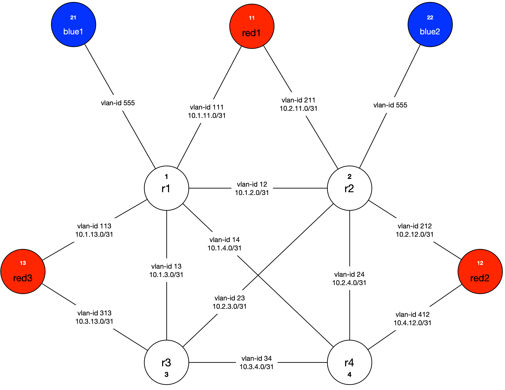

# MPLS Core with CEs on a single MX204

## What's This All About?

Some of my team were looking for an easy way to build out an MPLS environment to help learn about the tech. I pulled this out of my archives, and updated it from the old M10i I did it on to an MX204.

## Starting Point

Start with an MX204 on a recent Junos release. The one in our lab happened to be on 19.1r1, but I would suggest whatever the latest JTAC recommended code is, naturally.

Get yourself a couple of 40 or 100G DACs, AOCs, or some optics to plug into the 4x QSFP28s on the front. You're making 2 loops. Connect `et-0/0/0` to `et-0/0/1` and `et-0/0/2` to `et-0/0/3`. With the exception of the PE-CE links for EVPN, all core-side links on on the `et-0/0/[0-1]` loop, and the PE-CE links are on the `et-0/0/[2-3]` loop.

Each "link" uses a VLAN-tagged unit for isolation purposes. So, `et-0/0/0.123` would map to `et-0/0/1.123`, each with `vlan-id 123` configured.

Depending on how your MX204 is setup, you may need to do a little chassis stanza config to get the right ports lit up.  It looks like this:

```
chassis {
    fpc 0 {
        pic 0 {
            port 0 {
                speed 100g;
            }
            port 1 {
                speed 100g;
            }
            port 2 {
                speed 100g;
            }
            port 3 {
                speed 100g;
            }
        }
        pic 1 {
            number-of-ports 0;
        }
    }
}
```

If it all doesn't light right up, you may need to trigger a PFE reset. If you're unsure of how to do that, just reboot the system.

## Topology Being Simulated

* r[1-4]: Core Routers (converged P/PE)
* red[1-3]: Customer 1, aka Red - strictly L3VPN between 3 sites
* blue[1-2]: Customer 2, aka Blue - strictly EVPN, L2 stretch between 2 sites.



General rules...

1. Loopbacks are router# x4. In other words, red3 is 13.13.13.13/32.
2. P-t-P links are all /31 mask, lower IP going to the router with the lower ID # on the diagram. In other words, for the link between r1 and r2, the r1 end is 10.1.2.0/31 and the r2 end is 10.1.2.1/31.
3. On the EVPN (blue) instance, I didn't bother with loopbacks, and numbered the PE-facing interfaces as 10.200.200.ID/24.` 

## Global Router Config

Not much here - we're getting interfaces lined up, mainly.

```
set chassis fpc 0 pic 0 port 0 speed 100g
set chassis fpc 0 pic 0 port 1 speed 100g
set chassis fpc 0 pic 0 port 2 speed 100g
set chassis fpc 0 pic 0 port 3 speed 100g
set chassis fpc 0 pic 1 number-of-ports 0

set interfaces et-0/0/0 vlan-tagging
set interfaces et-0/0/0 encapsulation flexible-ethernet-services
set interfaces et-0/0/1 vlan-tagging
set interfaces et-0/0/1 encapsulation flexible-ethernet-services
set interfaces et-0/0/2 vlan-tagging
set interfaces et-0/0/2 encapsulation flexible-ethernet-services
set interfaces et-0/0/3 vlan-tagging
set interfaces et-0/0/3 encapsulation flexible-ethernet-services
```

## Building the Core...

### IP & IGP

```
set logical-systems r1 interfaces et-0/0/0 unit 12 description "r1 to r2"
set logical-systems r1 interfaces et-0/0/0 unit 12 vlan-id 12
set logical-systems r1 interfaces et-0/0/0 unit 12 family inet address 10.1.2.0/31
set logical-systems r1 interfaces et-0/0/0 unit 13 description "r1 to r3"
set logical-systems r1 interfaces et-0/0/0 unit 13 vlan-id 13
set logical-systems r1 interfaces et-0/0/0 unit 13 family inet address 10.1.3.0/31
set logical-systems r1 interfaces et-0/0/0 unit 14 description "r1 to r4"
set logical-systems r1 interfaces et-0/0/0 unit 14 vlan-id 14
set logical-systems r1 interfaces et-0/0/0 unit 14 family inet address 10.1.4.0/31
set logical-systems r1 interfaces lo0 unit 1 family inet address 1.1.1.1/32
set logical-systems r1 protocols ospf area 0.0.0.0 interface lo0.1 passive
set logical-systems r1 protocols ospf area 0.0.0.0 interface et-0/0/0.12
set logical-systems r1 protocols ospf area 0.0.0.0 interface et-0/0/0.13
set logical-systems r1 protocols ospf area 0.0.0.0 interface et-0/0/0.14
set logical-systems r1 routing-options router-id 1.1.1.1

set logical-systems r2 interfaces et-0/0/0 unit 23 description "r2 to r3"
set logical-systems r2 interfaces et-0/0/0 unit 23 vlan-id 23
set logical-systems r2 interfaces et-0/0/0 unit 23 family inet address 10.2.3.0/31
set logical-systems r2 interfaces et-0/0/0 unit 24 description "r2 to r4"
set logical-systems r2 interfaces et-0/0/0 unit 24 vlan-id 24
set logical-systems r2 interfaces et-0/0/0 unit 24 family inet address 10.2.4.0/31
set logical-systems r2 interfaces et-0/0/1 unit 12 description "r2 to r1"
set logical-systems r2 interfaces et-0/0/1 unit 12 vlan-id 12
set logical-systems r2 interfaces et-0/0/1 unit 12 family inet address 10.1.2.1/31
set logical-systems r2 interfaces lo0 unit 2 family inet address 2.2.2.2/32
set logical-systems r2 protocols ospf area 0.0.0.0 interface lo0.2 passive
set logical-systems r2 protocols ospf area 0.0.0.0 interface et-0/0/1.12
set logical-systems r2 protocols ospf area 0.0.0.0 interface et-0/0/0.23
set logical-systems r2 protocols ospf area 0.0.0.0 interface et-0/0/0.24
set logical-systems r2 routing-options router-id 2.2.2.2

set logical-systems r3 interfaces et-0/0/0 unit 34 description "r3 to r4"
set logical-systems r3 interfaces et-0/0/0 unit 34 vlan-id 34
set logical-systems r3 interfaces et-0/0/0 unit 34 family inet address 10.3.4.0/31
set logical-systems r3 interfaces et-0/0/1 unit 13 description "r3 to r1"
set logical-systems r3 interfaces et-0/0/1 unit 13 vlan-id 13
set logical-systems r3 interfaces et-0/0/1 unit 13 family inet address 10.1.3.1/31
set logical-systems r3 interfaces et-0/0/1 unit 23 description "r3 to r2"
set logical-systems r3 interfaces et-0/0/1 unit 23 vlan-id 23
set logical-systems r3 interfaces et-0/0/1 unit 23 family inet address 10.2.3.1/31
set logical-systems r3 interfaces lo0 unit 3 family inet address 3.3.3.3/32
set logical-systems r3 protocols ospf area 0.0.0.0 interface lo0.3 passive
set logical-systems r3 protocols ospf area 0.0.0.0 interface et-0/0/1.13
set logical-systems r3 protocols ospf area 0.0.0.0 interface et-0/0/1.23
set logical-systems r3 protocols ospf area 0.0.0.0 interface et-0/0/0.34
set logical-systems r3 routing-options router-id 3.3.3.3

set logical-systems r4 interfaces et-0/0/1 unit 14 description "r4 to r1"
set logical-systems r4 interfaces et-0/0/1 unit 14 vlan-id 14
set logical-systems r4 interfaces et-0/0/1 unit 14 family inet address 10.1.4.1/31
set logical-systems r4 interfaces et-0/0/1 unit 24 description "r4 to r2"
set logical-systems r4 interfaces et-0/0/1 unit 24 vlan-id 24
set logical-systems r4 interfaces et-0/0/1 unit 24 family inet address 10.2.4.1/31
set logical-systems r4 interfaces et-0/0/1 unit 34 description "r4 to r3"
set logical-systems r4 interfaces et-0/0/1 unit 34 vlan-id 34
set logical-systems r4 interfaces et-0/0/1 unit 34 family inet address 10.3.4.1/31
set logical-systems r4 interfaces lo0 unit 4 family inet address 4.4.4.4/32
set logical-systems r4 protocols ospf area 0.0.0.0 interface lo0.4 passive
set logical-systems r4 protocols ospf area 0.0.0.0 interface et-0/0/1.14
set logical-systems r4 protocols ospf area 0.0.0.0 interface et-0/0/1.24
set logical-systems r4 protocols ospf area 0.0.0.0 interface et-0/0/1.34
set logical-systems r4 routing-options router-id 4.4.4.4
```

### Configure Core iBGP Mesh, inet-vpn/vpnv4 family, bfd

```
set logical-systems r1 routing-options autonomous-system 65000
set logical-systems r1 protocols bgp group CORE type internal
set logical-systems r1 protocols bgp group CORE local-address 1.1.1.1
set logical-systems r1 protocols bgp group CORE family inet-vpn unicast
set logical-systems r1 protocols bgp group CORE family evpn signaling
set logical-systems r1 protocols bgp group CORE bfd-liveness-detection minimum-interval 300
set logical-systems r1 protocols bgp group CORE bfd-liveness-detection multiplier 3
set logical-systems r1 protocols bgp group CORE neighbor 2.2.2.2
set logical-systems r1 protocols bgp group CORE neighbor 3.3.3.3
set logical-systems r1 protocols bgp group CORE neighbor 4.4.4.4

set logical-systems r2 routing-options autonomous-system 65000
set logical-systems r2 protocols bgp group CORE type internal
set logical-systems r2 protocols bgp group CORE local-address 2.2.2.2
set logical-systems r2 protocols bgp group CORE family inet-vpn unicast
set logical-systems r2 protocols bgp group CORE family evpn signaling
set logical-systems r2 protocols bgp group CORE bfd-liveness-detection minimum-interval 300
set logical-systems r2 protocols bgp group CORE bfd-liveness-detection multiplier 3
set logical-systems r2 protocols bgp group CORE neighbor 1.1.1.1
set logical-systems r2 protocols bgp group CORE neighbor 3.3.3.3
set logical-systems r2 protocols bgp group CORE neighbor 4.4.4.4

set logical-systems r3 routing-options autonomous-system 65000
set logical-systems r3 protocols bgp group CORE type internal
set logical-systems r3 protocols bgp group CORE local-address 3.3.3.3
set logical-systems r3 protocols bgp group CORE family inet-vpn unicast
set logical-systems r3 protocols bgp group CORE family evpn signaling
set logical-systems r3 protocols bgp group CORE bfd-liveness-detection minimum-interval 300
set logical-systems r3 protocols bgp group CORE bfd-liveness-detection multiplier 3
set logical-systems r3 protocols bgp group CORE neighbor 1.1.1.1
set logical-systems r3 protocols bgp group CORE neighbor 2.2.2.2
set logical-systems r3 protocols bgp group CORE neighbor 4.4.4.4

set logical-systems r4 routing-options autonomous-system 65000
set logical-systems r4 protocols bgp group CORE type internal
set logical-systems r4 protocols bgp group CORE local-address 4.4.4.4
set logical-systems r4 protocols bgp group CORE family inet-vpn unicast
set logical-systems r4 protocols bgp group CORE family evpn signaling
set logical-systems r4 protocols bgp group CORE bfd-liveness-detection minimum-interval 300
set logical-systems r4 protocols bgp group CORE bfd-liveness-detection multiplier 3
set logical-systems r4 protocols bgp group CORE neighbor 1.1.1.1
set logical-systems r4 protocols bgp group CORE neighbor 2.2.2.2
set logical-systems r4 protocols bgp group CORE neighbor 3.3.3.3
```

### Add LDP, MPLS protocols, configure interfaces to pass MPLS frames.

```
set logical-systems r1 interfaces et-0/0/0 unit 12 family mpls
set logical-systems r1 interfaces et-0/0/0 unit 13 family mpls
set logical-systems r1 interfaces et-0/0/0 unit 14 family mpls
set logical-systems r1 protocols ldp interface et-0/0/0.12
set logical-systems r1 protocols ldp interface et-0/0/0.13
set logical-systems r1 protocols ldp interface et-0/0/0.14
set logical-systems r1 protocols mpls interface et-0/0/0.12
set logical-systems r1 protocols mpls interface et-0/0/0.13
set logical-systems r1 protocols mpls interface et-0/0/0.14

set logical-systems r2 interfaces et-0/0/0 unit 23 family mpls
set logical-systems r2 interfaces et-0/0/0 unit 24 family mpls
set logical-systems r2 interfaces et-0/0/1 unit 12 family mpls
set logical-systems r2 protocols ldp interface et-0/0/0.23
set logical-systems r2 protocols ldp interface et-0/0/0.24
set logical-systems r2 protocols ldp interface et-0/0/1.12
set logical-systems r2 protocols mpls interface et-0/0/1.12
set logical-systems r2 protocols mpls interface et-0/0/0.23
set logical-systems r2 protocols mpls interface et-0/0/0.24

set logical-systems r3 interfaces et-0/0/1 unit 13 family mpls
set logical-systems r3 interfaces et-0/0/1 unit 23 family mpls
set logical-systems r3 interfaces et-0/0/0 unit 34 family mpls
set logical-systems r3 protocols ldp interface et-0/0/0.34
set logical-systems r3 protocols ldp interface et-0/0/1.13
set logical-systems r3 protocols ldp interface et-0/0/1.23
set logical-systems r3 protocols mpls interface et-0/0/1.13
set logical-systems r3 protocols mpls interface et-0/0/1.23
set logical-systems r3 protocols mpls interface et-0/0/0.34

set logical-systems r4 interfaces et-0/0/1 unit 14 family mpls
set logical-systems r4 interfaces et-0/0/1 unit 24 family mpls
set logical-systems r4 interfaces et-0/0/1 unit 34 family mpls
set logical-systems r4 protocols ldp interface et-0/0/1.14
set logical-systems r4 protocols ldp interface et-0/0/1.24
set logical-systems r4 protocols ldp interface et-0/0/1.34
set logical-systems r4 protocols mpls interface et-0/0/1.14
set logical-systems r4 protocols mpls interface et-0/0/1.24
set logical-systems r4 protocols mpls interface et-0/0/1.34
```

### Configure Red CEs IP connectivity to PEs

```
set logical-systems red1 interfaces et-0/0/3 unit 111 description "red1 to r1"
set logical-systems red1 interfaces et-0/0/3 unit 111 vlan-id 111
set logical-systems red1 interfaces et-0/0/3 unit 111 family inet address 10.1.11.1/31
set logical-systems red1 interfaces et-0/0/3 unit 211 description "red1 to r2"
set logical-systems red1 interfaces et-0/0/3 unit 211 vlan-id 211
set logical-systems red1 interfaces et-0/0/3 unit 211 family inet address 10.2.11.1/31
set logical-systems red1 interfaces lo0 unit 11 family inet address 11.11.11.11/32
set logical-systems red1 routing-options router-id 11.11.11.11

set logical-systems red2 interfaces et-0/0/3 unit 212 description "red2 to r2"
set logical-systems red2 interfaces et-0/0/3 unit 212 vlan-id 212
set logical-systems red2 interfaces et-0/0/3 unit 212 family inet address 10.2.12.1/31
set logical-systems red2 interfaces et-0/0/3 unit 412 description "red2 to r4"
set logical-systems red2 interfaces et-0/0/3 unit 412 vlan-id 412
set logical-systems red2 interfaces et-0/0/3 unit 412 family inet address 10.4.12.1/31
set logical-systems red2 interfaces lo0 unit 12 family inet address 12.12.12.12/32

set logical-systems red3 interfaces et-0/0/3 unit 113 description "red3 to r1"
set logical-systems red3 interfaces et-0/0/3 unit 113 vlan-id 113
set logical-systems red3 interfaces et-0/0/3 unit 113 family inet address 10.1.13.1/31
set logical-systems red3 interfaces et-0/0/3 unit 313 description "red3 to r3"
set logical-systems red3 interfaces et-0/0/3 unit 313 vlan-id 313
set logical-systems red3 interfaces et-0/0/3 unit 313 family inet address 10.3.13.1/31
set logical-systems red3 interfaces lo0 unit 13 family inet address 13.13.13.13/32

set logical-systems r1 interfaces et-0/0/2 unit 111 description "r1 to red1"
set logical-systems r1 interfaces et-0/0/2 unit 111 vlan-id 111
set logical-systems r1 interfaces et-0/0/2 unit 111 family inet address 10.1.11.0/31
set logical-systems r1 interfaces et-0/0/2 unit 113 description "r1 to red3"
set logical-systems r1 interfaces et-0/0/2 unit 113 vlan-id 113
set logical-systems r1 interfaces et-0/0/2 unit 113 family inet address 10.1.13.0/31

set logical-systems r2 interfaces et-0/0/2 unit 211 description "r2 to red1"
set logical-systems r2 interfaces et-0/0/2 unit 211 vlan-id 211
set logical-systems r2 interfaces et-0/0/2 unit 211 family inet address 10.2.11.0/31
set logical-systems r2 interfaces et-0/0/2 unit 212 description "r2 to red2"
set logical-systems r2 interfaces et-0/0/2 unit 212 vlan-id 212
set logical-systems r2 interfaces et-0/0/2 unit 212 family inet address 10.2.12.0/31

set logical-systems r3 interfaces et-0/0/2 unit 313 description "r3 to red3"
set logical-systems r3 interfaces et-0/0/2 unit 313 vlan-id 313
set logical-systems r3 interfaces et-0/0/2 unit 313 family inet address 10.3.13.0/31

set logical-systems r4 interfaces et-0/0/2 unit 412 description "r4 to red2"
set logical-systems r4 interfaces et-0/0/2 unit 412 vlan-id 412
set logical-systems r4 interfaces et-0/0/2 unit 412 family inet address 10.4.12.0/31
```

### Setup export policy on Red CEs, configure VRFs on PEs

```
set logical-systems red1 policy-options policy-statement export-l3vpn term 1 from interface lo0.11
set logical-systems red1 policy-options policy-statement export-l3vpn term 1 then accept
set logical-systems red1 policy-options policy-statement export-l3vpn term last then reject
set logical-systems red1 routing-options autonomous-system 65011
set logical-systems red1 protocols bgp group WAN type external
set logical-systems red1 protocols bgp group WAN export export-l3vpn
set logical-systems red1 protocols bgp group WAN peer-as 65000
set logical-systems red1 protocols bgp group WAN neighbor 10.1.11.0
set logical-systems red1 protocols bgp group WAN neighbor 10.2.11.0

set logical-systems red2 policy-options policy-statement export-l3vpn term 1 from interface lo0.12
set logical-systems red2 policy-options policy-statement export-l3vpn term 1 then accept
set logical-systems red2 policy-options policy-statement export-l3vpn term last then reject
set logical-systems red2 routing-options autonomous-system 65012
set logical-systems red2 protocols bgp group WAN type external
set logical-systems red2 protocols bgp group WAN export export-l3vpn
set logical-systems red2 protocols bgp group WAN peer-as 65000
set logical-systems red2 protocols bgp group WAN neighbor 10.2.12.0
set logical-systems red2 protocols bgp group WAN neighbor 10.4.12.0

set logical-systems red3 policy-options policy-statement export-l3vpn term 1 from interface lo0.13
set logical-systems red3 policy-options policy-statement export-l3vpn term 1 then accept
set logical-systems red3 policy-options policy-statement export-l3vpn term last then reject
set logical-systems red3 routing-options autonomous-system 65013
set logical-systems red3 protocols bgp group WAN type external
set logical-systems red3 protocols bgp group WAN export export-l3vpn
set logical-systems red3 protocols bgp group WAN peer-as 65000
set logical-systems red3 protocols bgp group WAN neighbor 10.1.13.0
set logical-systems red3 protocols bgp group WAN neighbor 10.3.13.0

set logical-systems r1 routing-instances red instance-type vrf
set logical-systems r1 routing-instances red interface et-0/0/2.111
set logical-systems r1 routing-instances red interface et-0/0/2.113
set logical-systems r1 routing-instances red route-distinguisher 1.1.1.1:100
set logical-systems r1 routing-instances red vrf-target target:65000:100
set logical-systems r1 routing-instances red protocols bgp group CE type external
set logical-systems r1 routing-instances red protocols bgp group CE neighbor 10.1.11.1 peer-as 65011
set logical-systems r1 routing-instances red protocols bgp group CE neighbor 10.1.13.1 peer-as 65013

set logical-systems r2 routing-instances red instance-type vrf
set logical-systems r2 routing-instances red interface et-0/0/2.211
set logical-systems r2 routing-instances red interface et-0/0/2.212
set logical-systems r2 routing-instances red route-distinguisher 2.2.2.2:100
set logical-systems r2 routing-instances red vrf-target target:65000:100
set logical-systems r2 routing-instances red protocols bgp group CE type external
set logical-systems r2 routing-instances red protocols bgp group CE neighbor 10.2.11.1 peer-as 65011
set logical-systems r2 routing-instances red protocols bgp group CE neighbor 10.2.12.1 peer-as 65012

set logical-systems r3 routing-instances red instance-type vrf
set logical-systems r3 routing-instances red interface et-0/0/2.313
set logical-systems r3 routing-instances red route-distinguisher 3.3.3.3:100
set logical-systems r3 routing-instances red vrf-target target:65000:100
set logical-systems r3 routing-instances red protocols bgp group CE type external
set logical-systems r3 routing-instances red protocols bgp group CE neighbor 10.3.13.1 peer-as 65013

set logical-systems r4 routing-instances red instance-type vrf
set logical-systems r4 routing-instances red interface et-0/0/2.412
set logical-systems r4 routing-instances red route-distinguisher 4.4.4.4:100
set logical-systems r4 routing-instances red vrf-target target:65000:100
set logical-systems r4 routing-instances red protocols bgp group CE type external
set logical-systems r4 routing-instances red protocols bgp group CE neighbor 10.4.12.1 peer-as 65012
```

### Configure Blue CEs and PE interfaces

```
set logical-systems blue1 interfaces et-0/0/1 unit 555 description "blue1 to r1"
set logical-systems blue1 interfaces et-0/0/1 unit 555 vlan-id 121
set logical-systems blue1 interfaces et-0/0/1 unit 555 family inet address 10.200.200.21/24

set logical-systems blue2 interfaces et-0/0/3 unit 555 description "blue2 to r2"
set logical-systems blue2 interfaces et-0/0/3 unit 555 vlan-id 222
set logical-systems blue2 interfaces et-0/0/3 unit 555 family inet address 10.200.200.22/24

set logical-systems r1 interfaces et-0/0/0 unit 555 description "r1 to blue1"
set logical-systems r1 interfaces et-0/0/0 unit 555 encapsulation vlan-bridge
set logical-systems r1 interfaces et-0/0/0 unit 555 vlan-id 555

set logical-systems r2 interfaces et-0/0/2 unit 555 description "r2 to blue2"
set logical-systems r2 interfaces et-0/0/2 unit 555 encapsulation vlan-bridge
set logical-systems r2 interfaces et-0/0/2 unit 555 vlan-id 555
```

### Configure evpn

```
set logical-systems r1 routing-instances blue instance-type evpn
set logical-systems r1 routing-instances blue interface et-0/0/2.121
set logical-systems r1 routing-instances blue route-distinguisher 1.1.1.1:200
set logical-systems r1 routing-instances blue vrf-target target:65000:200
set logical-systems r1 routing-instances blue protocols evpn

set logical-systems r2 routing-instances blue instance-type evpn
set logical-systems r2 routing-instances blue interface et-0/0/2.555
set logical-systems r2 routing-instances blue route-distinguisher 2.2.2.2:200
set logical-systems r2 routing-instances blue vrf-target target:65000:200
set logical-systems r2 routing-instances blue protocols evpn
```

## Ok, How Do I Use This Now?

Easy. Most commands you'd run on a router can also be run inside a logical system. For example, want to check and see if the Blue EVPN is working? Try this on for size:

```ping 10.200.200.22 logical-system blue1```

You just initiated a ping from blue1 to blue2, going through the EVPN instance.

Or, maybe you want to see the routing table on the red3 CE:

```show route terse logical-system red3```

## What's next?

This document is using LDP for signaling. Why not convert to RSVP? `set proto ospf traffic-engineering` on each of the PEs to get started. Next, light up `RSVP` on the core-side interfaces, just like it's done for LDP right now. Once you make the move to RSVP-TE, of course, you'll need to define your LSPs. Start off by making a full-mesh of LSPs between the PEs

For example:    `set logical-systems r1 protocols mpls label-switched-path r1-to-r2 to 2.2.2.2`. Maybe add some `fast-reroute` for good measure even.

By default, the Traffic Engineering Database, or the TED, for short, will be automatically calculated from your IGP, effectively equivalent to LDP. Try your hand at some strict-path LSPs instead of just allowing the IGP to figure it out for you. Maybe add some bandwidth constraints too.

Go nuts, have fun.
